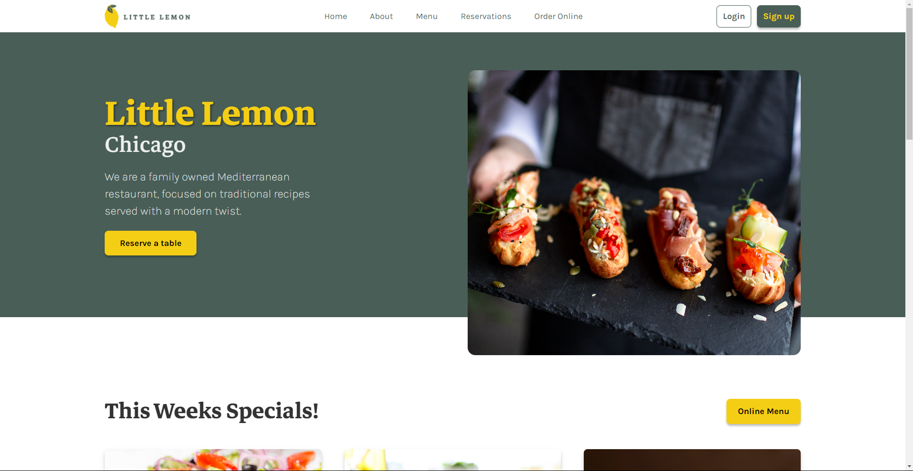
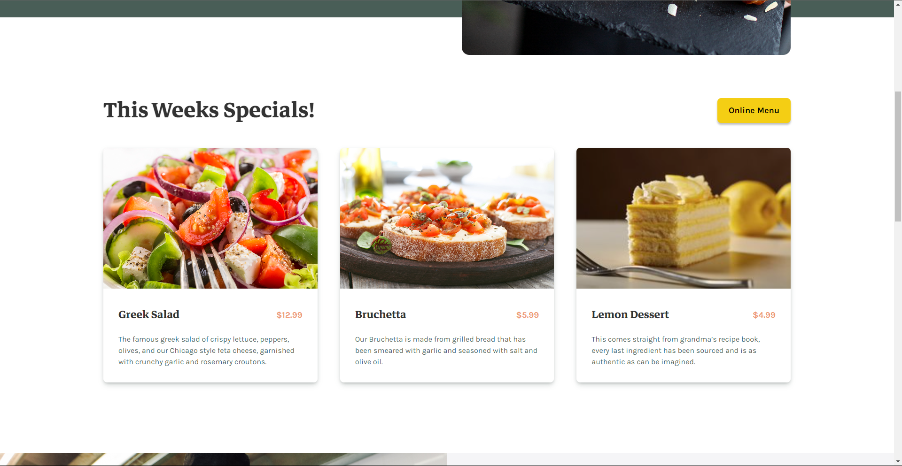
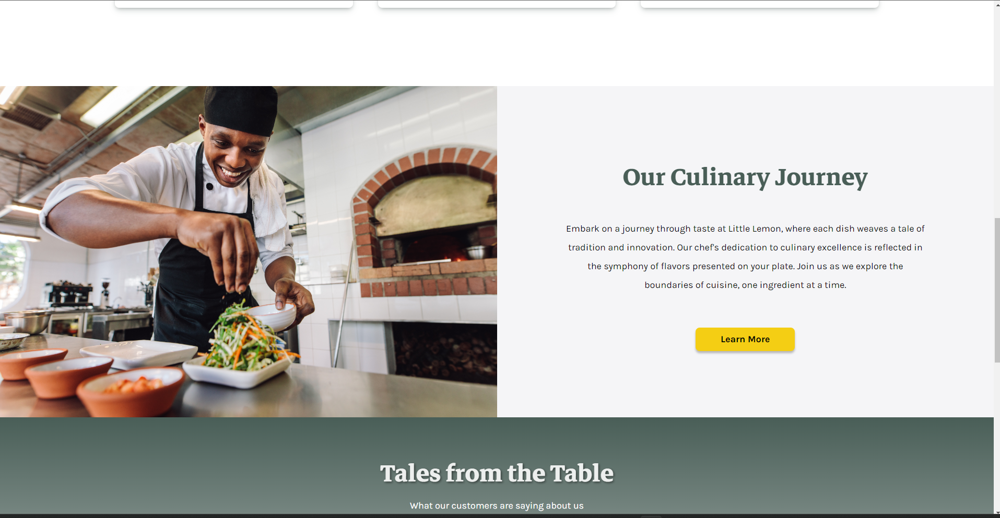
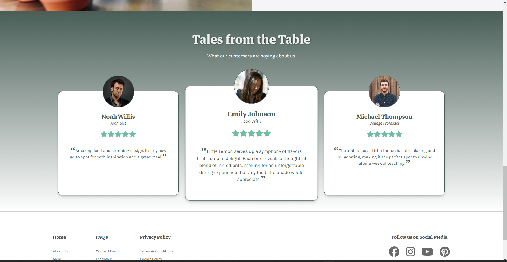
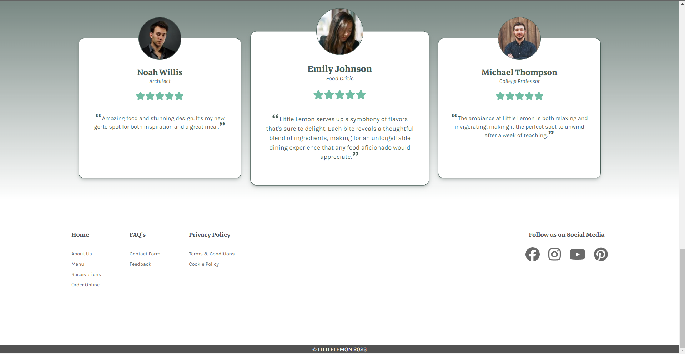
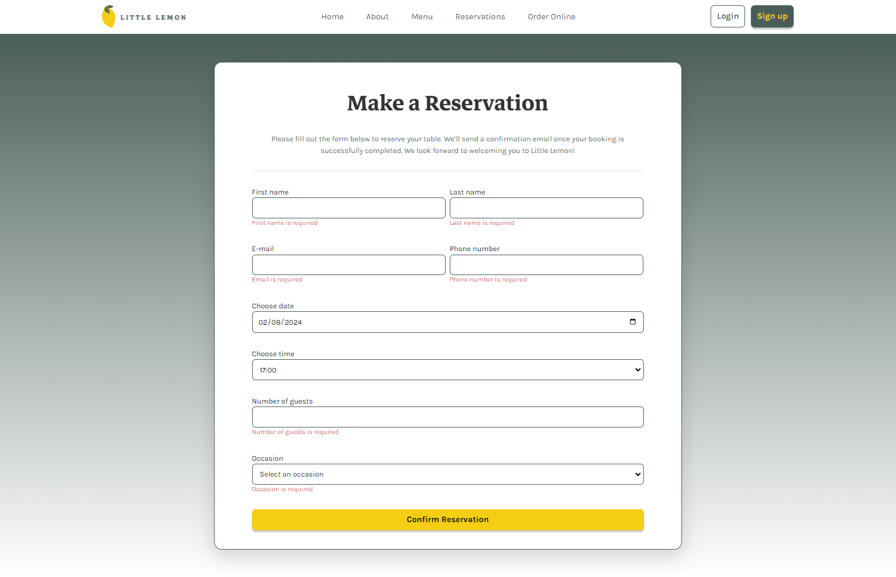

# Little Lemon Restaurant

THis is the Capstone project for the Meta Front-End Developer Professional Certificate. The project is a website for a restaurant called Little Lemon. The website is built using React and Vite.

## Description

The Little Lemon Restaurant website is an interactive and user-friendly platform for the esteemed patrons of our restaurant. It offers a seamless browsing experience where you can make reservations, view our extensive menu, and check out the latest specials.

## Installation

To get started with the Little Lemon Restaurant website, you need to have Node.js installed on your system. After that, follow these steps:

1. Clone the repository to your local machine.
2. Navigate to the project directory.
3. Run `npm install` to install all the dependencies.

## Running the Project

To run the project, use the following command:

```bash
npm run dev
```

## Dependencies

- "react": "^18.2.0"
- "react-dom": "^18.2.0"
- "react-router-dom": "^6.21.3"
- "normalize.css": "^8.0.1"
- "formik": "^2.4.5"
- "yup": "^1.3.3"
- "@fortawesome/fontawesome-svg-core": "^6.5.1"
- "@fortawesome/free-brands-svg-icons": "^6.5.1"
- "@fortawesome/free-regular-svg-icons": "^6.5.1"
- "@fortawesome/free-solid-svg-icons": "^6.5.1"
- "@fortawesome/react-fontawesome": "^0.2.0"

## Features

- **Online Reservations**: Book your table at Little Lemon with just a few clicks.
- **Menu and Specials**: Explore our diverse menu and daily specials.

## Technologies

This project is built using the following technologies:

- React
- Vite
- SCSS

## Website Images

#### Header and Hero Section


#### Specials Section


#### About Section


#### Testimonials Section


#### Footer Section


#### Reservation Page


#### Confirmation Page


## License

This project is currently not under any specific license.

## Acknowledgments

Developer: Gean C. Hevia Cruz

---

Enjoy your virtual visit to Little Lemon Restaurant!
